## Methodology

### How?

- The base dataset was downloaded as a CSV from Kaggle. 
- Additional information was collected using APIs from Spotify and MusicBrainz.
- A registry of ISRC codes and their corresponding territories was used to extract registration country from ISRC codes.

### Where?

- The base dataset:\
https://www.kaggle.com/datasets/nelgiriyewithana/most-streamed-spotify-songs-2024
- The Spotify API: https://developer.spotify.com/documentation/web-api
- The MusicBrainz API: https://musicbrainz.org/doc/MusicBrainz_API
- The ISRC registry: https://isrc.ifpi.org/downloads/Valid_Characters.pdf

### Why?

- The base dataset provided information about track popularity across many different social media platforms. Therefore it is a great starting point for trying to understand the influence of social media on music streaming. 
- The Spotify and MusicBrainz APIs provided comprehensive information about each track. The Spotify API was mainly used for cleaning corrupt rows present in the base dataset. The MusicBrainz API supplied additional information for each track. Additional APIs such as that of Last.fm might be used in the future to gather more information on each track. 
- The ISRC registry was needed to translate ISRC codes to territories.

>[!TIP]
> Use the table of contents in the right sidebar for easy navigation 

## API Examples & Interfacing

### Examples

#### Spotify

**Endpoint:**\
```GET https://api.spotify.com/v1/search?q=isrc:{isrc}&type=track&limit=1```

> [!IMPORTANT]
> Also requires authorization token in header. See:\
> https://developer.spotify.com/documentation/web-api/tutorials/client-credentials-flow

{}

``` {filename="Request"}
GET https://api.spotify.com/v1/search?q=isrc:USRC11301155&type=track
```

```json {filename="Response"}
{
  "tracks": {
    "items": [
      {
        "id": "2takcwOaAZWiXQijPHIx7B",
        "name": "Radioactive",
        "artists": [
          {
            "id": "53XhwfbYqKCa1cC15pYq2q",
            "name": "Imagine Dragons"
          }
        ],
        "album": {
          "id": "6wXHn83b4N1sE6H5hGTA92",
          "name": "Night Visions",
          "release_date": "2012-09-04"
        },
        "isrc": "USRC11301155",
        "duration_ms": 186320,
        "popularity": 85,
        "external_urls": {
          "spotify": "https://open.spotify.com/track/2takcwOaAZWiXQijPHIx7B"
        }
      }
    ]
  }
}
```

{}

#### MusicBrainz

**Endpoint:**\
```GET https://musicbrainz.org/ws/2/recording?query=isrc:{isrc}&fmt=json```

{}

``` {filename="Request"}
GET https://musicbrainz.org/ws/2/recording?query=isrc:USRC11301155&fmt=json
```

```json {filename="Response"}
{
  "recordings": [
    {
      "id": "bd403f5c-9b9c-4ef7-b8ad-96f902f051c6",
      "title": "Radioactive",
      "length": 186000,
      "artist-credit": [
        {
          "artist": {
            "id": "01234567-89ab-cdef-0123-456789abcdef",
            "name": "Imagine Dragons"
          }
        }
      ],
      "releases": [
        {
          "id": "4f3c63a4-42bb-4f27-9cc7-6e755ed1d45c",
          "title": "Night Visions",
          "release-date": "2012-09-04"
        }
      ],
      "isrcs": ["USRC11301155"]
    }
  ]
}
```

{}

### Interfacing

First, each API was tested and experimented with in Jupyter notebooks. These are located in the `notebooks/` folder under the project root, e.g. `notebooks/spotify-api.ipynb`. 

After gaining a sufficient understanding of each API, the code for interfacing with each was moved into modules, where they could be subsequently be imported into and used in later notebooks, such as `cleaning-integration.ipynb`. 

These modules are located under `src/api/spotify/` and `src/api/musicbrainz/` under the project root.

{}



  
  ```python {filename="authenticator.py"}
  import os
  import time
  import json
  import base64
  import requests
  import subprocess
  import sys

  subprocess.check_call([sys.executable, '-m', 'pip', 'install', 'python-dotenv'])
  from dotenv import load_dotenv

  from utils.logger import logger

  load_dotenv()

  TOKEN_ENDPOINT = 'https://accounts.spotify.com/api/token'
  TOKEN_FILE = 'spotify_token.json'

  def get_spotify_credentials():
      """Load Spotify API credentials from .env file."""
      client_id = os.getenv('CLIENT_ID')
      client_secret = os.getenv('CLIENT_SECRET')
      
      if not client_id or not client_secret:
          raise ValueError('Missing Spotify credentials. Need CLIENT_ID and CLIENT_SECRET')
          
      return client_id, client_secret

  def load_token():
      """Loads most recent access token."""
      if os.path.exists(TOKEN_FILE):
          try:
              with open(TOKEN_FILE, 'r') as file:
                  data = json.load(file)
                  return data.get('access_token'), data.get('expires_at', 0)
          except (json.JSONDecodeError, FileNotFoundError) as e:
              logger.warning(f'Could not load token file: {e}')
              
      return None, 0

  def save_token(access_token, expires_at):
      """Saves access token for persistence."""
      with open(TOKEN_FILE, 'w') as file:
          json.dump({'access_token': access_token, 'expires_at': expires_at}, file)
          
  def get_token():
      """Returns access token or refreshes token if expired."""
      access_token, expires_at = load_token()
      
      if access_token and time.time() < expires_at:
          return access_token
      
      logger.info('Refreshing Spotify access token...')
      
      client_id, client_secret = get_spotify_credentials()
      credentials = f'{client_id}:{client_secret}'
      encoded_credentials = base64.b64encode(credentials.encode()).decode()
      
      headers = {
          'Authorization': f'Basic {encoded_credentials}',
          'Content-Type': 'application/x-www-form-urlencoded'
      }
      data = {'grant_type': 'client_credentials'}
      
      response = requests.post(TOKEN_ENDPOINT, headers=headers, data=data)
      
      if response.status_code == 200:
          token_data = response.json()
          access_token = token_data['access_token']
          expires_at = time.time() + token_data['expires_in'] - 60
          
          save_token(access_token, expires_at)
          logger.info('Access token refreshed successfully!')
          return access_token
      else:
          message = f'Failed to refresh token: {response.status_code}, {response.text}'
          logger.error(message)
          raise Exception(message)
  ```
  
  
  ```python {filename="search.py"}
  import requests
  from utils.logger import logger
  from api.spotify.authenticator import get_token

  SEARCH_ENDPOINT = 'https://api.spotify.com/v1/search'

  def extract_track_info(results, isrc):
      """Exctract track name, album name, and artist name from response."""
      items = results.get('tracks', {}).get('items', [])
      if items:
          top_result = items[0]
          return {
              'Track': top_result['name'],
              'Album Name': top_result['album']['name'],
              'Artist': top_result['artists'][0]['name'],
              'ISRC': isrc
          }
      else:
          logger.warning(f'No results found for ISRC {isrc}')
          return None

  def search_isrc(isrc, category='track', limit=1, extractor=extract_track_info):
      """Search Spotify for media using ISRC (International Standard Recording Code)."""
      token = get_token()
      headers = {'Authorization': f'Bearer {token}'}
      
      query = f'isrc:{isrc}'
      params = {'q': query, 'type': category, 'limit': limit}
      
      response = requests.get(SEARCH_ENDPOINT, headers=headers, params=params)
      
      if response.status_code == 200:
          return extractor(response.json(), isrc)
      else:
          logger.error(f'Error {response.status_code} for ISRC {isrc}: {response.text}')
          return None
  ```
  



{}

{}



  
  ```python {filename="search.py"}
  import requests
  from utils.logger import logger

  SEARCH_ENDPOINT = 'https://musicbrainz.org/ws/2/recording/'

  def extract_recording_info(results, isrc):
      """Extracts and aggregates length, release count, and tags from the API response."""
      recordings = results.get('recordings', [])
      
      # not found -> Length = None
      # found, but no valid lengths -> Length = 0
      # found, valid lengths -> Length = length_avg
      if not recordings:
          logger.warning(f'No recordings found for ISRC {isrc}')
          return {'Length': None, 'Releases': 0, 'Genres': [], 'ISRC': isrc}
      
      total_length = 0
      total_releases = 0
      tags_set = set()
      valid_lengths = 0

      for recording in recordings:
          # extract length
          length = recording.get('length')
          if length:
              total_length += length
              valid_lengths += 1

          # count releases
          releases = recording.get('releases', [])
          total_releases += len(releases)

          # collect tags
          tags = recording.get('tags', [])
          tags_set.update(tag['name'] for tag in tags if 'name' in tag)

      # average length in seconds
      length_avg = (total_length / valid_lengths / 1000) if valid_lengths > 0 else None

      return {
          'Length': length_avg,
          'Releases': total_releases,
          'Genres': list(tags_set),
          'ISRC': isrc
      }

  def search_isrc(isrc, extractor=extract_recording_info):
      """Search MusicBrainz for track information using ISRC."""
      headers = {'User-Agent': 'DataScienceProject/1.0 ( miva6981@colorado.edu )'}
      
      query = f'isrc:{isrc}'
      params = {'query': query, 'fmt': 'json'}

      response = requests.get(SEARCH_ENDPOINT, headers=headers, params=params)

      if response.status_code == 200:
          return extractor(response.json(), isrc)
      elif response.status_code == 503:
          raise RuntimeError(f'Rate limit reached at {isrc}')
      else:
          logger.error(f'Error {response.status_code} for ISRC {isrc}: {response.text}')
          return None
  ```
  



{}

## Cleaning & Integration

The base dataset downloaded from Kaggle before any modification is found in `data/Most_Streamed_Spotify_Songs_2024_utf8` under the project root. 

Here is a snippet of that dataset:

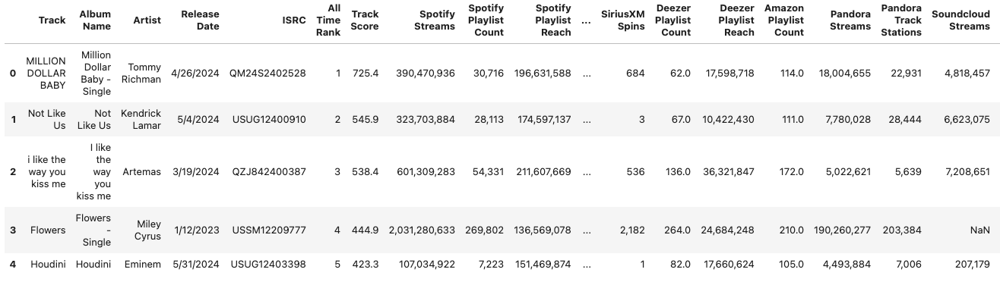

>[!NOTE]
> Source code, Jupyter notebooks, and data are stored in this repository:\
> https://github.com/michael-van-vuuren/csci5612-workspace

### Imports

First, the API interface modules were imported into `cleaning-integration.ipynb`.

```python {filename=""}
import pandas as pd
import json
import sys
import os

sys.path.append(os.path.abspath('../src'))

# import API packages
import api.spotify.search as spt
import api.musicbrainz.search as mb
```

### Corrupted Characters

The creator of the CSV dataset improperly encoded the data when uploading, resulting in many corrupted characters, e.g.,

1. `Track` on Line **89**: Tit�� Me Pregu
2. `Album Name` on Line **28**: ýýýýýýýýý ýýýýýý ýýýýýýýýýýýý

After unsuccessfully trying various decoding methods, Spotify's API was used to fix the corrupted text. Each track in the dataset has an ISRC (International Standard Recording Code), and Spotify provides ISRC metadata for most tracks. By matching ISRCs, the correct metadata replaces the corrupted metadata with properly encoded UTF-8 values. Here index **30** and **31** are corrupted.

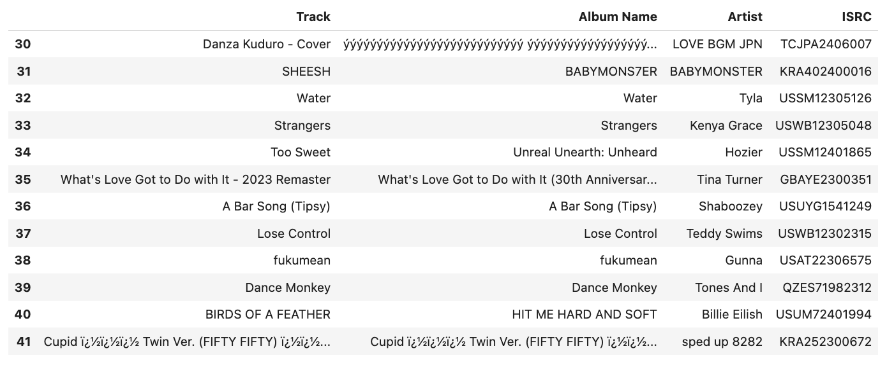

#### 1. Using the Spotify API to correct corrupted rows

Here, we find the corrupted rows in the dataset, and use the Spotify API to search for the correct values. The results are stored in accepted and rejected dataframes, where accepted holds all corrected rows (as well rows that were correct to begin with), and rejected holds rows that could not be corrected.

The module to interact with Spotify API has already been imported as `spt`.

```python {filename=""}
import pandas as pd
import time

def contains_non_ascii(s):
    """Check if string contains any non-ASCII characters."""
    return any(ord(c) >= 128 for c in str(s))

def corrupted_row(row):
    """Check if a row contains any non-ASCII strings."""
    return any(contains_non_ascii(row[col]) for col in ['Track', 'Album Name', 'Artist'])

def count_corrupted_rows(df):
    """Count corrupted rows."""
    return sum(corrupted_row(row) for _, row in df.iterrows())

def clean_corrupted_rows(df):
    """Correct corrupted rows."""
    accepted, rejected = [], []
    
    i = 0
    total_corrupted_rows = count_corrupted_rows(df)
    print('Corrupted rows processed:')
    
    for _, row in df.iterrows():
        if corrupted_row(row):
            result = spt.search_isrc(row['ISRC'])
            time.sleep(0.5) # adhere to rate limit (conservatively ~120 req/min)
            if result:
                accepted.append(result)
            else:
                rejected.append(row.to_dict())
            i += 1
            print(f'{i}/{total_corrupted_rows} --- {round((i/total_corrupted_rows)*100)}% complete.')
        else:
            accepted.append(row.to_dict())
            
    return pd.DataFrame(accepted), pd.DataFrame(rejected)

accepted, rejected = clean_corrupted_rows(base_corrupt)
```

Snippet of accepted dataframe:

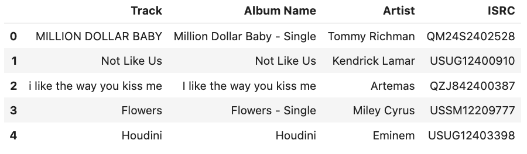

There are only 22 corrupted rows that could not be corrected. Given the number of rows the original dataset, and the fact that keeping these rows with faulty ISRCs would be problematic for further API calls, these are excluded from the dataset.

#### 2. Joining the base dataframe and accepted dataframe

Now the accepted dataframe and base dataframe can be joined. To do this, an inner merge is appropriate, because accepted has less rows than the base dataframe, and we want to drop rows that are in the rejected dataframe. We should expect to get `len(accepted) = 4578` rows after merging.

```python {filename=""}
# drop info columns from base dataframe for easy merge
base_to_merge = base.drop(columns=['Track', 'Album Name', 'Artist'])

# inner merge accepted and base_to_merge dataframes
base_not_corrupt = base_to_merge.merge(accepted, on='ISRC', how='inner')
len(base_not_corrupt) # outputs 4582
```

#### 3. Removing duplicate rows

We get 4 additional rows. Why? Lets check for duplicated rows:

```python {filename=""}
base_not_corrupt[base_not_corrupt['ISRC'].duplicated()]
```

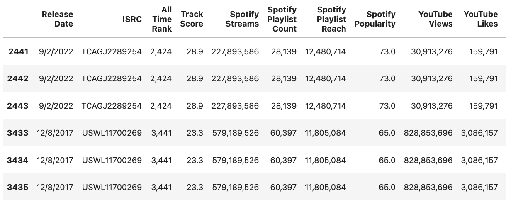

We can see we have 4 duplicated rows. Lets remove these:

```python {filename=""}
base_not_corrupt = base_not_corrupt.drop_duplicates(subset=['ISRC'], keep='first')
len(base_not_corrupt) # outputs 4576 (lost an additional 2 rows because the accepted dataframe started out with duplicates)
```

#### 4. Reordering the columns

Finally, lets move `Track`, `Album Name`, and `Artist` back to the first beginning of the dataframe, along with `ISRC`.

```python {filename=""}
col_to_move = ['ISRC', 'Track', 'Album Name', 'Artist']

col_order = col_to_move + [col for col in base_not_corrupt.columns if col not in col_to_move]

base_not_corrupt = base_not_corrupt[col_order]
base_not_corrupt.head()
```

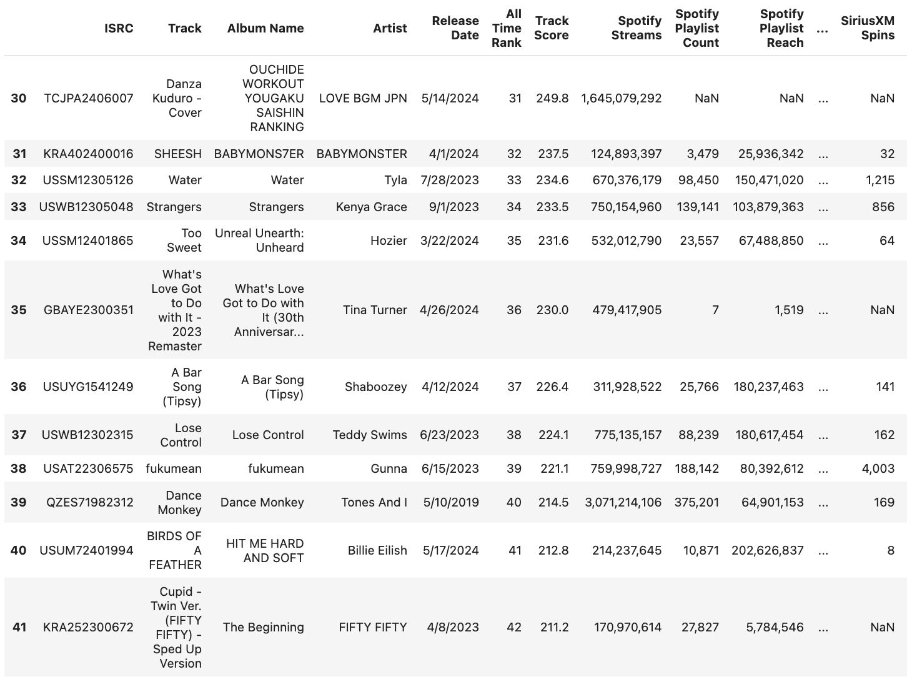

We can see that index **30** and **41** are no longer corrupted.

### Gathering Additional Features

We have a fairly comprehensive dataset in terms of metadata about each track (release date, popularity across platforms, etc.). However, we can gather additional data about each track using the MusicBrainz API and other methods. Last.fm and other sources will also be used later to gather more data; this is just a start.

#### 1. Gathering more data with MusicBrainz API

The module to interact with the MusicBrainz API has already been imported as `mb`.

**Adds features:** Length (seconds), Releases, Genres

Example:

```python {filename=""}
base[base['ISRC'] == 'USUM72404101']
```

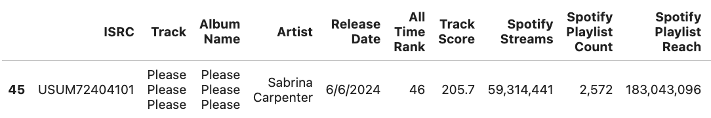

```python {filename=""}
mb.search_isrc('USUM72404101')
# outputs {'Length': 186.0, 'Releases': 29, 'Genres': ['pop'], 'ISRC': 'USUM72404101'}
```

Lets use `mb` to search the MusicBrainz database for every ISRC in order to extract the desired features:

```python {filename=""}
import pandas as pd
import time
import os

def fetch_track_info(df):
    """Fetch track information using ISRC for every row in the dataframe."""
    output_file = '../data/augmented.csv'
    file_exists = os.path.exists(output_file)
    
    total_rows = len(df)
    interval = max(1, total_rows // 10)  # 10 progress updates total
    
    print('Rows processed:')
    
    try:
        for i, (_, row) in enumerate(df.iterrows(), start=1):
            result = mb.search_isrc(row['ISRC'])
            time.sleep(1.2)  # adhere to rate limits conservatively

            if result:
                write_header = not file_exists and i == 1
                file_exists = True  
                pd.DataFrame([result]).to_csv(output_file, mode='a', header=write_header, index=False)

            if i % interval == 0 or i == total_rows:
                print(f'{i}/{total_rows} --- {round((i/total_rows)*100)}% complete.')
    
    except RuntimeError as e:
        print(f'Error: {e}')
        print(f'Terminated at row index {i-1}. Progress saved in data/augmented.csv. Restart with base[{i-1}:].')
        return

fetch_track_info(base[0:])
```

The result of the function is a dataframe with each of the additional features:

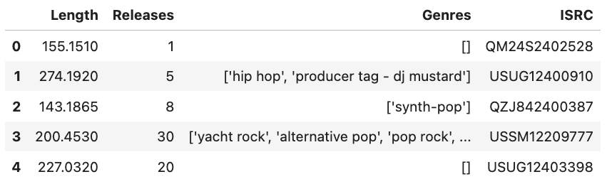

We have some missing values in the augmented dataset. To remedy each:

1. `Length` - Impute using median, since distribution has slight right skew.

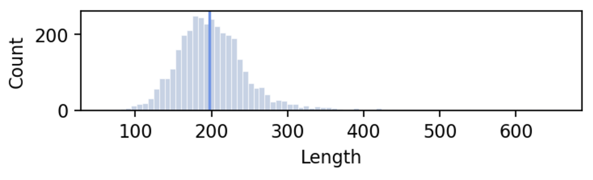

2. `Releases` - Set any values of 0 to 1, since the tracks have been released, they have just not been added to the crowdsourced MusicBrainz database. Nonetheless they most likely have only 1 release.
3. `Genres` - There are 2871 rows with missing genres; about half of all rows. Before training any models, more comprehensive genre information will be gathered using an additional API, Last.fm. For now, this will be left as is.

After imputing the missing values, join the augmented and base dataframes on `ISRC`. To do this, use either an inner or outer join.

```python {filename=""}
# inner merge augmented and base dataframes
base_augmented = base.merge(augmented, on='ISRC', how='inner')
```

#### 2. Extracting country data from ISRC codes

The first two letters of each ISRC encodes the country where the song was registered. It is true that many songs registered in the US are not actually made by people in the United States, so these are only approximations of the country of origin. Ideally the country of origin would be extracted by an API.

**Adds feature:** Registration Country

The first two letters of each `ISRC` can be translated according to this document: https://isrc.ifpi.org/downloads/Valid_Characters.pdf

This PDF has been converted to a CSV located at `data/isrc.csv`, and will be used to translate each `ISRC`.

```python {filename=""}
isrc_translations = pd.read_csv('../data/isrc.csv', skiprows=[1])
isrc_translations.head()
```

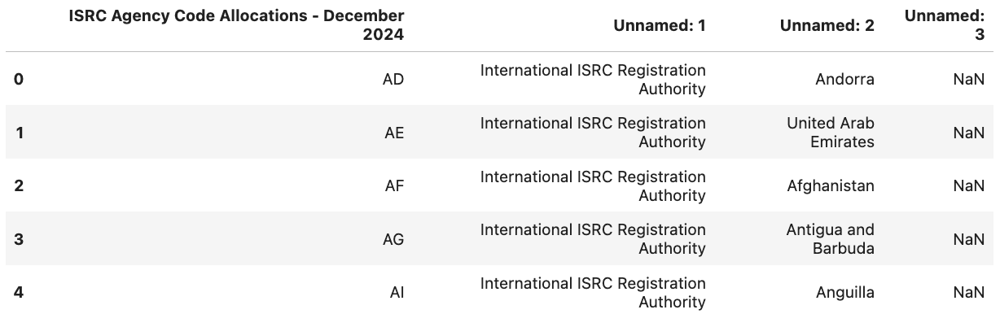

We are only interested in column 1 and 3. Drop the rest and rename column 1 and 3.

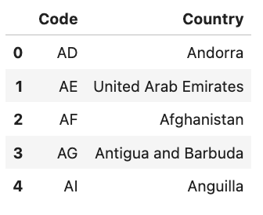

Now we can use the translations to create a new `Registration Country` column in our main dataset.

```python {filename=""}
# replace 'Worldwide' with 'United States' for visualization purposes
isrc_translations['Country'] = isrc_translations['Country'].replace('Worldwide', 'United States')
isrc_translations['Country'] = isrc_translations['Country'].replace('-', 'United States')

isrc_mapping = dict(zip(isrc_translations['Code'], isrc_translations['Country']))

def map_isrc_to_country(isrc_code):
    """Translates ISRC country code to country name."""
    prefix = isrc_code[:2]
    return isrc_mapping.get(prefix, 'Unknown')

base_augmented['Registration Country'] = base_augmented['ISRC'].apply(map_isrc_to_country)
base_augmented['Registration Country'].unique()
```

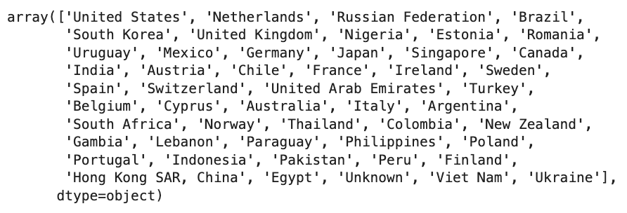

### Cleaning Primary Dataset

This section focuses on converting data types and handling missing values. The missing values in the dataset can be visualized:

```python {filename=""}
plt.figure(figsize=(20,8), dpi=150)
sns.heatmap(base_v1.isnull(), cmap='Blues_r')
plt.show()
```

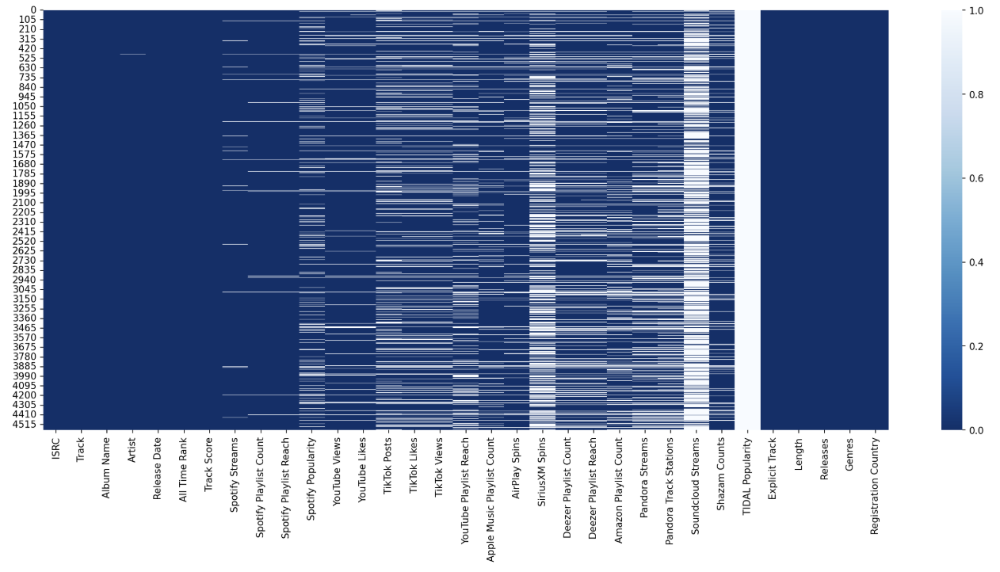

#### 1. Converting datatypes

Before imputing missing values, numerical object types must be converted to numerical types. The initial data types are:

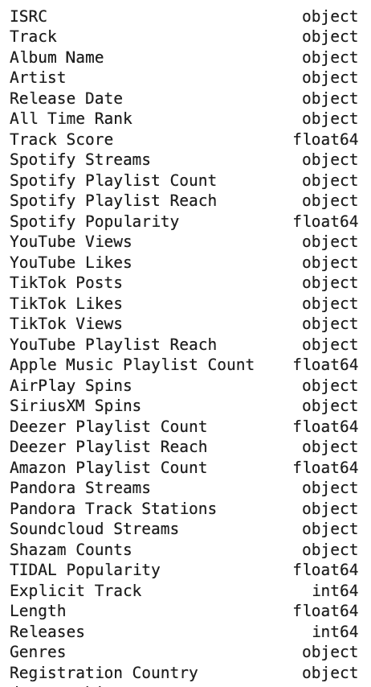

**Objects to integers:**

The reason there are so many objects is because integers have been stored with commas as strings. We can remedy this by removing the commas, then converting those with values to integers. Those with null values will be converted to -1, so that we can impute them later.

```python {filename=""}
cols_to_convert = ['All Time Rank', 
                   'Spotify Streams', 
                   'Spotify Playlist Count', 
                   'Spotify Playlist Reach', 
                   'YouTube Views', 
                   'YouTube Likes', 
                   'TikTok Posts', 
                   'TikTok Likes', 
                   'TikTok Views', 
                   'YouTube Playlist Reach', 
                   'AirPlay Spins', 
                   'SiriusXM Spins', 
                   'Deezer Playlist Reach', 
                   'Pandora Streams', 
                   'Pandora Track Stations', 
                   'Soundcloud Streams', 
                   'Shazam Counts']

for col in cols_to_convert:
    base_v1[col] = base_v1[col].fillna('-1').str.replace(',', '').astype('int64')
    
base_v1.dtypes
```

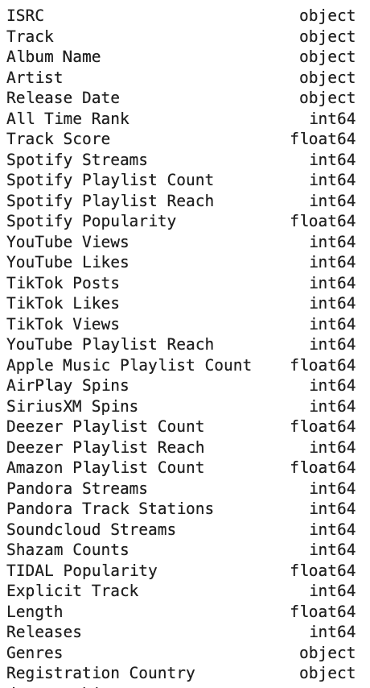

**Floats to integers:**

Many of the floating points should really be integers. 

```python {filename=""}
cols_to_convert = ['Spotify Popularity', 
                   'Apple Music Playlist Count', 
                   'Deezer Playlist Count', 
                   'Amazon Playlist Count']

for col in cols_to_convert:
    base_v1[col] = base_v1[col].fillna(-1).astype('int64')
    
base_v1.dtypes
```

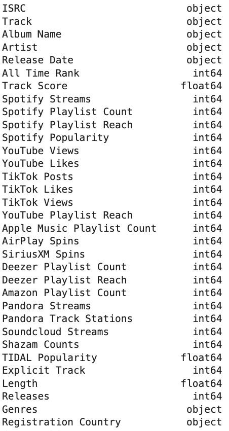

This is good for now. `Release Date` can be adjusted in the future.

#### 2. Handling missing values

**Missing artists:**

```python {filename=""}
base_v1[base_v1['Artist'].isnull()]
```

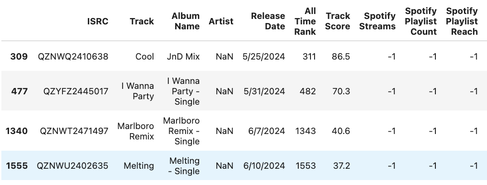

These songs are also missing streaming information, so they are dropped.

**Columns with many missing values:**

From the heatmap above, several columns have the majority of their values missing. In these cases, it is best to discard the columns since we have many other more complete columns.

```python {filename=""}
base_v1 = base_v1.drop(columns=['SiriusXM Spins', 'Soundcloud Streams', 'TIDAL Popularity'])
```

**Other missing values:**

For the remaining columns with missing values, using the medians of each column will work for now.

In the future, more sophisticated methods such as finding highly correlated columns, using one to determine the other, then dropping one of them might be better.

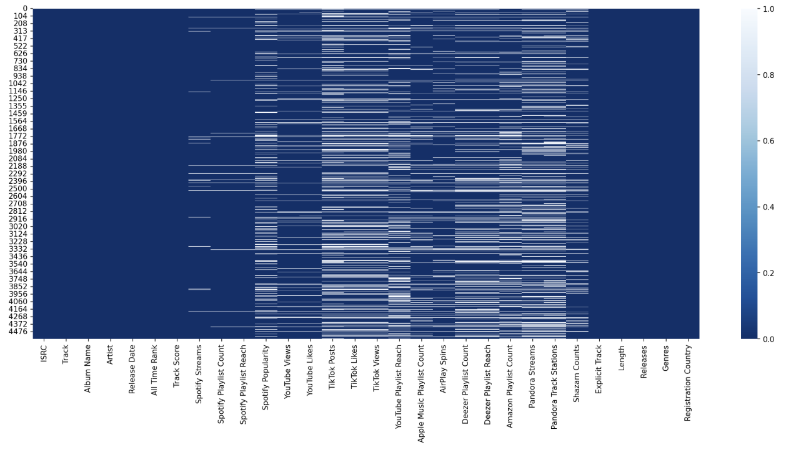

```python {filename=""}
for col in base_v1.columns:
    if base_v1[col].dtype == 'int64':
        col_median = base_v1.loc[base_v1[col] != -1, col].median()
        base_v1[col] = base_v1[col].replace(-1, int(col_median))
```

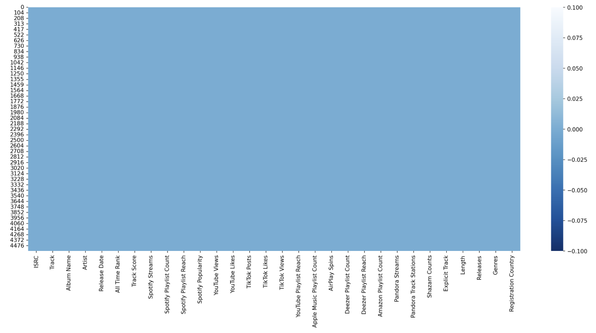

All the missing values have been handled (might come back and improve methodology in the future). 

### Creating Target Variable

Now we should create a target variable (target variable will vary depending on the model, but this will serve as the main target variable).

Since many of the columns in the dataset are about streaming numbers and popularity, the target variable should not be something like predicting Spotify streams, because that lead to a circular prediction model. Instead, a variable that represents the probability of a song being included in a playlist will be the target variable. Along with this variable will be a binned version, i.e. low and high probability, for use on classification models.

```python {filename=""}
base_v2.columns
```

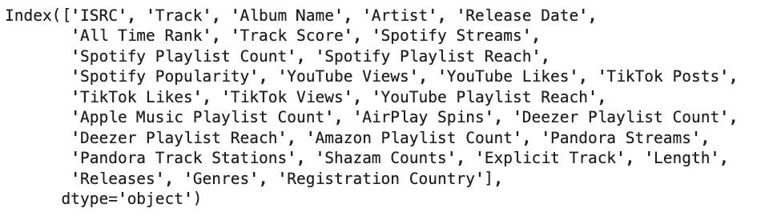

To create the target variable of playlist probability, we can combine the columns involving playlist counts and reaches into a probability as follows:

$$ P(\text{track being included in a playlist}) =$$
$$\sigma\left(\left(\alpha\sum_i \frac{\text{Playlist Count}_i}{max(\text{Playlist Count}_i)} + \beta\sum_i \frac{\text{Playlist Reach}_i}{max(\text{Playlist Reach}_i)}\right)^{0.5}\right)$$

where

1. $\sigma(x) = \frac{1}{1+e^{-x}}$, or the sigmoid function, is used to map a value between 0 and 1
2. $i$ represents each the playlist count and reach for each platform
3. $\alpha$ and $\beta$ are used to tune the weights of count and reach on the score
4. Square root of weighted sum is taken to correct heavy right skew

This works okay for now, but might be tweaked before training any models.

```python {filename=""}
import numpy as np
import pandas as pd

alpha = 0.5
beta = 0.5

playlist_count_cols = ['Spotify Playlist Count', 'Apple Music Playlist Count', 'Deezer Playlist Count', 'Amazon Playlist Count']
playlist_reach_cols = ['Spotify Playlist Reach', 'YouTube Playlist Reach', 'Deezer Playlist Reach']

df_norm = base_v2.copy()

# {playlist count}_i / max({playlist count}_i) and {playlist reach}_i / max({playlist reach}_i)
for col in playlist_count_cols + playlist_reach_cols:
    df_norm[col] = df_norm[col] / df_norm[col].max()
    
# alpha*sum(playlist count norms) + beta*sum(playlist reach norms)
df_norm['Playlist Score'] = alpha * df_norm[playlist_count_cols].sum(axis=1) + \
                            beta * df_norm[playlist_reach_cols].sum(axis=1)

# power transform for better spread
df_norm['Power Playlist Score'] = np.power(df_norm['Playlist Score'], 0.5)

# shifted sigmoid for likelihood calculation
df_norm['Playlist Probability'] = 1 / (1 + np.exp(-(df_norm['Power Playlist Score'])))

df_norm[['Track', 'Playlist Probability']]
```

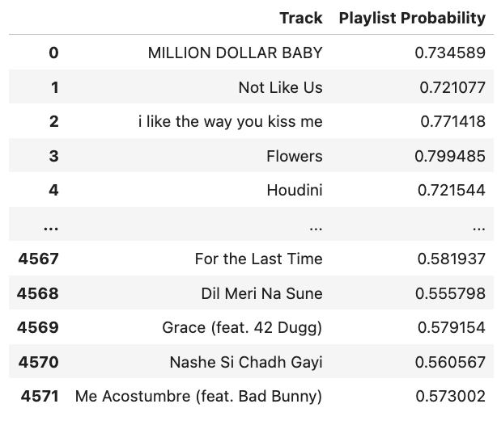

```python {filename=""}
sns.boxplot(x=df_norm['Playlist Probability'])
```


We can discretize `Playlist Probability` into two values: 

1. 0 for the lower 50%
2. 1 for the upper 50%

```python {filename=""}
median_probability = df_norm['Playlist Probability'].median()
median_probability

df_norm['High Playlist Probability'] = np.where(df_norm['Playlist Probability'] >= median_probability, 1, 0)
```

Now that we have a target variable, we drop the playlist columns from the dataset (they are still saved in another CSV if needed later). We also drop `Playlist Score` and `Power Playlist Score` for now.

## Exploratory Data Analysis (EDA)

1. 
2. 
3. 
4. 
5. 
6. 
7. 
8. 
9. 
10. 