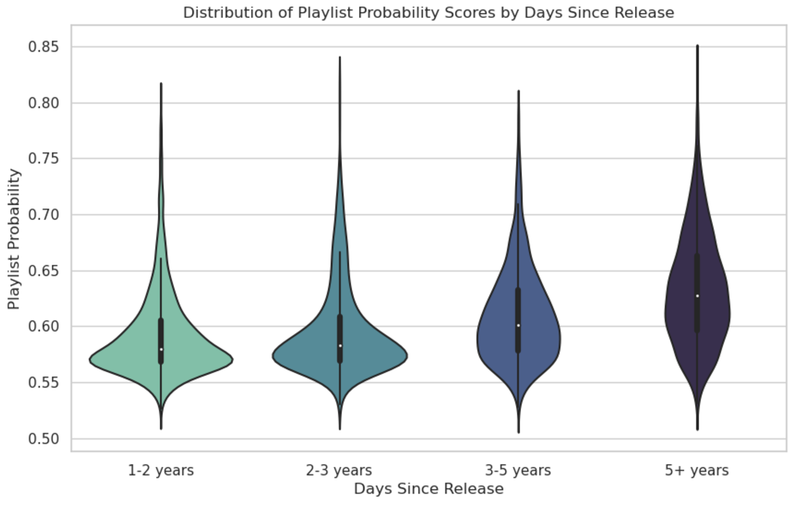

## Topic

Streaming platforms have reshaped how songs gain popularity and longevity. In the past, major record labels were a necessity for success. Nowadays, even small creators can achieve success due to recommendation algorithms and social media trends. Beyond streaming, social media platforms like TikTok have become powerful drivers of music discovery. Viral trends and challenges can propel a song to mainstream success, sometimes even before it gains traction on traditional streaming services. In 2024, 13 out of the 16 songs that reached No.1 on the U.S. Billboard Hot 100 were linked to TikTok trends ([Music Business Worldwide](https://www.musicbusinessworldwide.com/tiktok-reveals-its-top-songs-of-2024-says-that-13-of-16-no-1-hits-in-the-us-this-year-are-linked-to-trends-on-its-platform/)).

*Paradigm shift in music distribution and consumption ([The Honest Broker](https://www.honest-broker.com/p/results-of-my-survey-who-deserves))*

Since the rise of digital streaming, playlist inclusion on platforms like Spotify and Apple Music has become a critical factor in determining a song’s success. A song that gets added to a playlist is both appealing on first listen and after repeated listens. Therfore a song's inclusion in playlists signifies its long-term listening appeal. 

The primary focus of this project is to predict the probability of a song being added to a playlist, using a dataset enriched with streaming statistics, social media engagement, and metadata from APIs like Spotify and MusicBrainz.

Additional subtopics to be explored include:

- Determining to what extent social media influences track popularity
- Identifying characteristics of songs that contribute to long-term success and replayability
- Investigating the interaction between streaming platform algorithms and organic listener engagement
- And more!

### Why?

A song’s ability to sustain engagement over time is crucial in today’s music industry. Playlist-worthy songs not only attract immediate attention but also maintain their appeal over multiple listens. Understanding what makes a song "playlist material" can help artists, record labels, and streaming platforms optimize their strategies for song promotion, curation, and discovery.

### Who is affected?

- **Artists and Producers:** Understanding what makes a song playlist-worthy can guide creative and promotion decisions
- **Record Labels:** Predicting playlist inclusion can help with marketing strategies
- **Streaming Platforms:** Improving recommendation algorithms based on playlist behavior can increase listening time
- **Listeners:** Playlists with good songs enhance the user experience

### Related work

Several studies and industry reports have explored factors influencing song popularity, such as the impact of streaming algorithms, social media trends, and audio features. 

**Hit Song Prediction:** Machine learning has been applied to predict a song’s success based on audio features, lyrics, and listener engagement. A study from "Frontiers in Artificial Intelligence" found that neural data significantly improves hit song classification accuracy ([Frontiers](https://www.frontiersin.org/journals/artificial-intelligence/articles/10.3389/frai.2023.1154663/full)).

**Social Media Influence:** Platforms like TikTok and YouTube have reshaped music discovery, often determining which songs become hits. Research from "Neuroscience News" found that social networks can increase music popularity prediction accuracy by 50% ([Neuroscience News](https://neurosciencenews.com/social-connections-music-26294/)).

This project builds upon these studies by integrating streaming statistics, social media engagement metrics, and metadata to predict a song's probability of being added to playlists, an important metric to determine the long-term engagement of a song.

## Research Questions

1. What audio and metadata features correlate with high playlist inclusion probability?
2. How do social media engagement metrics (e.g. TikTok posts, YouTube likes) influence playlist-worthiness?
3. Does playlist inclusion probability differ across genres and regions?
4. How do streaming performance metrics (e.g. Spotify popularity, YouTube views) relate to playlist inclusion?
5. Does song length affect playlist-worthiness?
6. Do newer songs have a higher probability of being included in playlists compared to older tracks?
7. What impact does a song’s initial viral success have on its long-term playlist performance?
8. What differences exist in playlist curation strategies across streaming platforms?
9. How accurately can machine learning models predict whether a song will be added to a playlist?
10. What characteristics distinguish user-generated playlists from editorially curated ones?

## Visualizations

>[!NOTE]
>To see how these visualizations were created, visit [here](https://michael-van-vuuren.github.io/csci5612/eda/#exploratory-data-analysis-eda).

**1. Number of Track Registrations by Country** 

The dataset contains registration country information for each of the tracks, which approximitely indicates the region of the artist who produced the track. A map showing how many tracks are registered in each country is useful to get an idea of where the artists of the most popular songs are located and how generalizable to decisions guided by the data are. Based on this, more data can be gathered for countries that are lacking in registration counts.

**2. Distributions of Playlist Probability Scores by Days Since Release**

Understanding how release date affects the likelihood of a song being included in a playlist is important. From the visualization below, it is clear that older songs have a greater likelihood of being included in playlists.

**3. Streaming and Social Media Song Platform Popularity**

The pie charts below show which platforms generate the most streams and views for all the songs in the dataset. In terms of streaming, Spotify dominates in total streams. In terms of social media, TikTok dominates in total views.

**4. Playlist Probability vs Song Length**

Understanding how the length of a song affects its playlist-worthiness is useful. From the scatterplot below, it seems that there is a possible positive correlation between playlist-worthiness and song length

**5. Correlations Between Streaming and Social Media Metrics**

It is important to be aware of how different features in the dataset correlate with each other. Highly correlated features can be dropped so as to leave a single feature to lower dimensionality, and weakly correlated features might provide useful information when used together. The pairplot below was log-transformed because the distributions for each feature had heavy right skews. By transforming the data, it becomes easier to see the relationships between each feature, since they are more centered. Certain features like `Spotify Streams` and `Shazam Counts` appear highly correlated; others are less so. The vertical and horizontal lines visible in each plot are a result of the imputation from earlier in which missing values of a feature were replaced by the feature's median.  

**6. Correlation Amounts Between Streaming and Social Media Metrics**

This heatmap is supplemental to the pairplot above. It provides correlation scores for each pair of metrics. Pairs that intersect at darker squares have greater correlations. 

**7. How Playlist Probability Changes Based on Number of TikTok Posts**

This visualization identifies how the number of TikTok posts that include a song affects its probability of being included in a playlist. From the boxenplots below, the extent to which TikTok popularity affects playlist-worthiness is clear: More posts means a higher value and variance in playlist probability.

**8. Playlist Probability by Release Year**

The line plot below shows that older songs are indeed more likely to be included in playlists. 

**9. The Most Popular Artists**

The visualization below summarizes the top 20 most popular artists across streaming and social media platforms. Some of the results and surprising, while others are expected.

**10. Genre Word Cloud**

The most common genres are visible in this word cloud. It appears that most of the songs are either hip hop, electronic, pop, and pop rock. This makes sense because these genres are easy to get into and are popular. 

