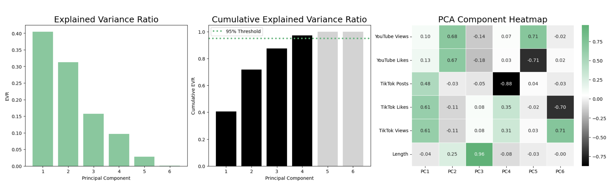

## Principal Component Analysis

### Definition

text

### Methodology

text

### Visualizations

#### Two Principal Components


  
  Spotify song ranks range from **1** to **~4500** and are based on numerous metrics, such as streams and listening time.

  _2D.png)

  
    
  
  

  
  Points are divided into groups with low/high (**0**/**1**) probability of being included on a playlist.

  _2D.png)

  
    
  
  


#### Three Principal Components


  
  Spotify song ranks range from **1** to **~4500** and are based on numerous metrics, such as streams and listening time.

  _3D.png)

  
    
  
  

  
  Points are divided into groups with low/high (**0**/**1**) probability of being included on a playlist.

  _3D.png)

  
    
  
  


### Variance and Loadings

